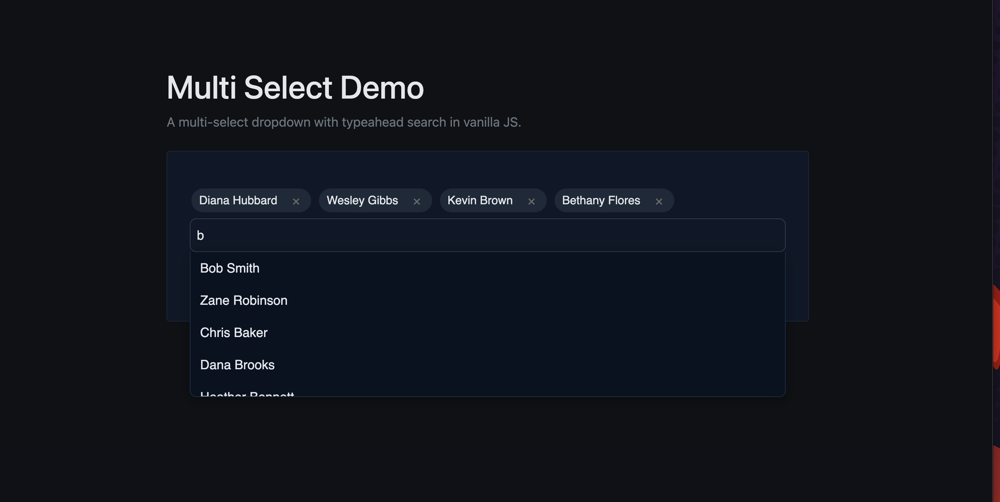

# Multi-Select Typeahead Dropdown

A simple **multi-select dropdown with typeahead search**, built using vanilla JavaScript and styled with Bootstrap and custom CSS. Users can search through a dataset of people, select multiple names at once, and manage selections with removable chips.

## Features

- Typeahead search: Fetches suggestions as you type  
- Multi-select support: Choose multiple people in one session  
- Chips UI: Selected people appear as removable chips  
- Keyboard support:
  - Arrow Up/Down to navigate
  - Enter to select
  - Backspace to remove the last chip when input is empty  
- Click-to-select suggestions  
- Bootstrap & custom styles for clean UI  
- Mock API with fetch interceptor simulates async data loading  
- Does not use the `<select>` element, ensuring consistent rendering and usability on mobile devices  

## Demo

  

## Getting Started

### Option 1: Run with VS Code and Live Server (recommended)

1. Clone the repo:

   ```bash
   git clone https://github.com/CoderFoundry/multiSelect.git
   cd your-repo-name

### Run with VS Code and Live Server 


Install the Live Server extension if you don’t already have it.

Right-click on index.html in VS Code and select “Open with Live Server”.
This will launch the project in your browser at http://127.0.0.1:5500/ (or a similar port).
